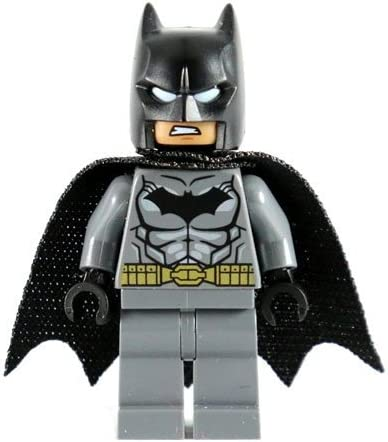

*Hello, world!*

**Hello, world!**

# Heading 1
Hello, world!

## Heading 2 
Hello, world!



[Click Me!](https://commonmark.org/help/)

> I'd rather go 0-for-30 than go 0-for-9 because you go 0-for-9, that means you stopped shooting. That means you lost confidence Dion Waiters

* Apples
* Bananas 
* Oranges 

1. One
2. Two
3. Three

---

`inline code`


``` woah
this 
is 
block
code
