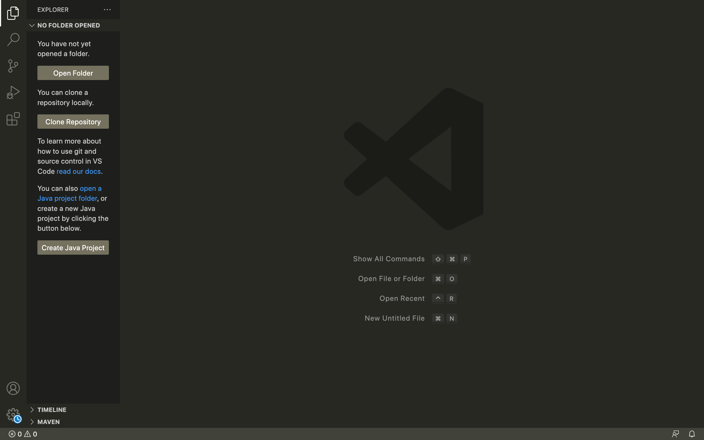
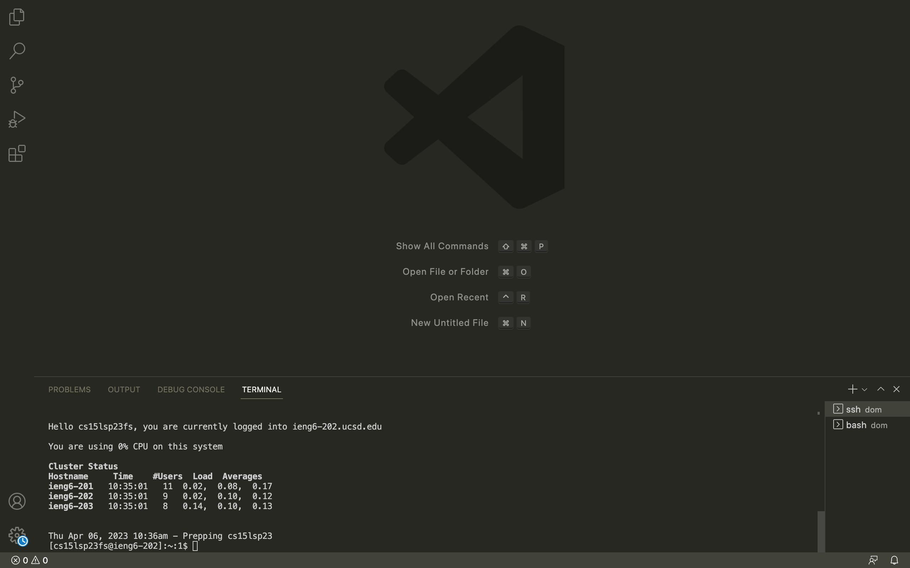
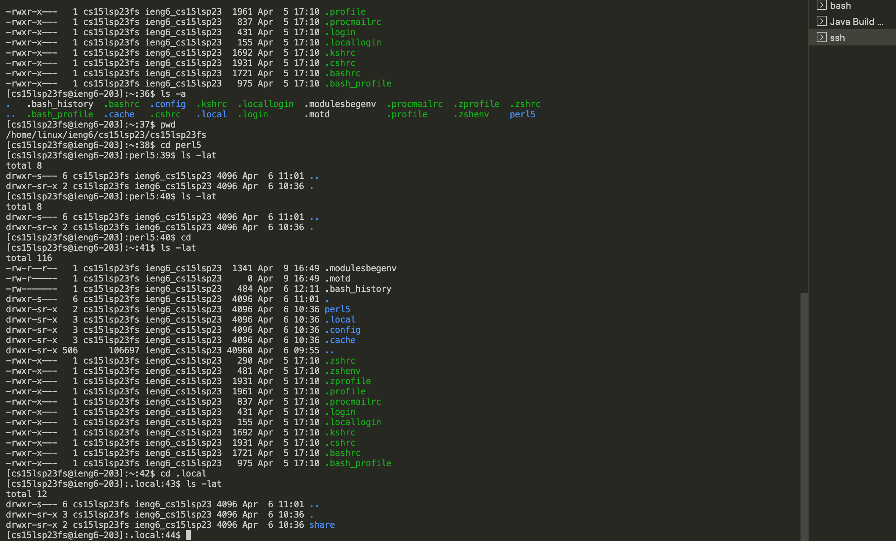

# Lab Report 1 - Remote Access and Filesystem
## Installing Virtual Studio Code

* If you don't have Virtual Studio code already on your computer, you should install it using their website installation link [https://code.visualstudio.com/](https://code.visualstudio.com/)
* Once you install the version suited for your computer OS, it should look like this:

**Note**: If you already had VS code installed on your computer: you can skip this step!

---
Remotely Conntecting to Course-Specific Account

* You start by opening terminal either on your computer's terminal or on VS code and styping in ssh followed by your course-specific account name (formatted like this cs15lsp23zz@ieng6.ucsd.edu)
* Since it was my first time connecting to the server, I received a confirmation message asking if I wanted to connect to the server (said yes)
* It also asks for your account's password, so I filled that in next

Many people had trouble with this section so here are a couple reminders:
* The password doesn't show as you type in the terminal
* Make sure you reset your account's password correctly **otherwise** you'll receive an incorrect message

Assuming the above is followed, here is the output when you've succesfully logged into the terminal!

---
Running Commands
* This section was pretty straightforward where all I needed to do was type in different commands and see what they did
* **tip**: to logout from connection to server, enter ctrd + d into terminal

Heres an example of some of these commands and their outputs: 

---
After this point, you will have successfully logged into the course specific account on the ieng6! 
