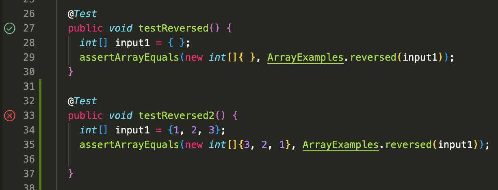
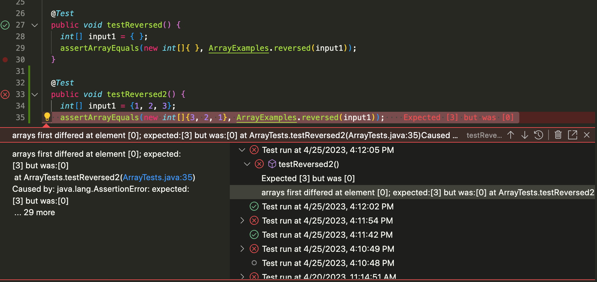

# Lab Report 2

## Part 1: Creating a Web Server


## Part 2: Failing Output

```
@Test
public void testReversed() {
int[] input1 = {1, 2, 3};
assertArrayEquals(new int[]{3, 2, 1}, ArrayEquals.reversed(input1));

}
```
### Failure-Inducing Output
- One example of a failure-inducing ouput for the `Reverse` method in `ArrayExamples.java` is the input above, `int[] input1 = {1, 2, 3}` which ends up returning an array of all 0's ( `{0, 0, 0}` ) instead of reversing the order of the elements in the provided list.

```
public void testReversed() {
int[] input2 = {0, 0, 0, 0};
assertArrayEquals(new int[]{0, 0, 0, 0}, ArrayEquals.reversed(input2));

}
```
### Non-Failure Inducing Output
- An example of an input that doesn't produce a failure would be a array list like the one given above, `int[] input2 = {0, 0, 0, 0}`

### The Symptom


### Bug
#### Before
```
static int[] reversed(int[] arr) {
    int[] newArray = new int[arr.length];
    for(int i = 0; i < arr.length; i += 1) {
      arr[i] = newArray[arr.length - i - 1];
    }
    return arr;
  }
```
#### After
```
static int[] reversed(int[] arr) {
    int[] newArray = new int[arr.length];
    for(int i = 0; i < arr.length; i += 1) {
      newArray[i] = arr[arr.length - i - 1];
    }
    return newArray;
  }
```
- The issue with the code in the before code that produces a failing test result is that the for loop is assigning reversed values from `newArray` to the original `arr`. Additionally, the method is returning the orginial array, meaning that the values of 0 from `newArray` are replacing the orginal int values in `arr`. 
- The way to fix these errors would be to swap `arr[i]` with `newArray[i]`, `newArray[...]` with `arr[...]`, and then changing the return array to `newArray` in order for the new array to get assigned values from the array used in the method parameter
---
## Part 3: Week 2/3 Recap
Something interesting I learned from week 2 of CSE15L lab was that there were three different ieng6 computers could be accessed and they aren't allowed the run the same port at the same time as others using the same computer. Ports are used for computers to relay internet and network messages when connected to a server. Therefore, if several students using an `ieng6-201` computer have to select different port numbers in order to run their web server.
