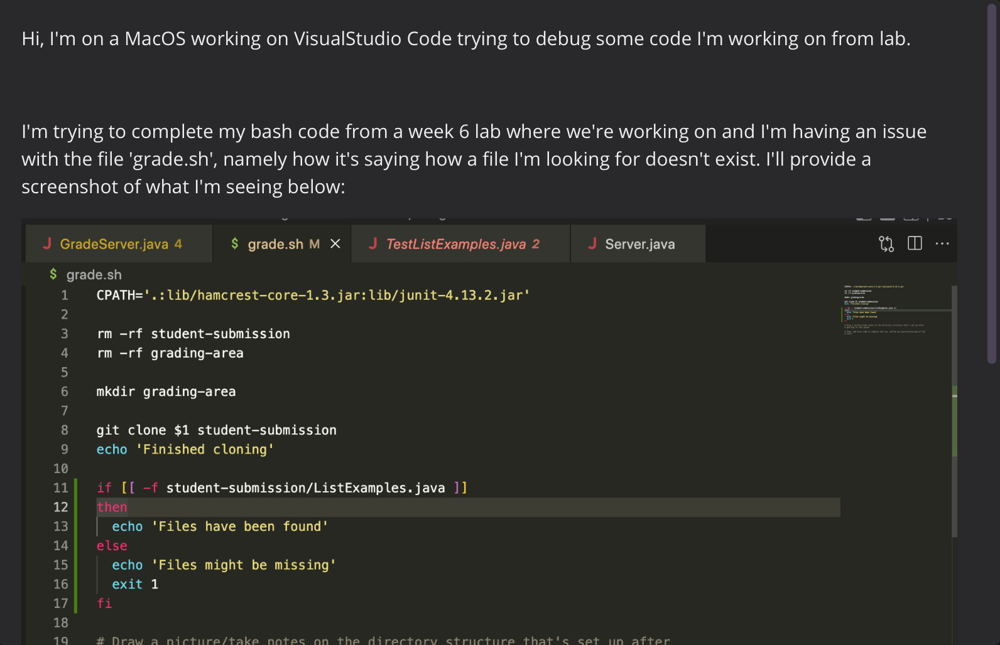
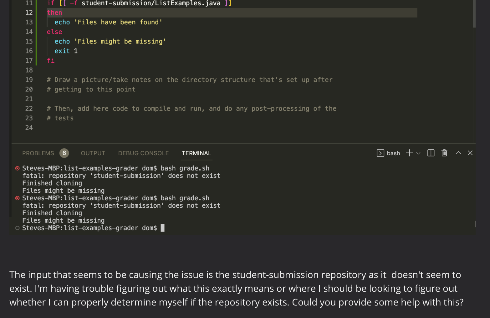
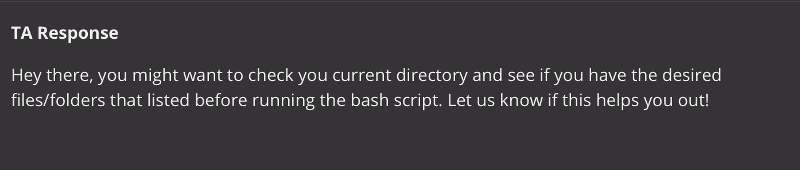

# Lab Report 5: Debugging Scnario/Reflection

## Part 1: Debugging Scenario

The student's error ended up being that their list of files and driectories didn't match the names of the files and directories they were trying to use within their bash script.

## Part 2: Reflection

Something interesting I learned more about within the second half of the quarter from class is the use of if statements from bash script. From parameters to syntax, there are a few nuances that I found interesting compared to if statements we learn in java.
